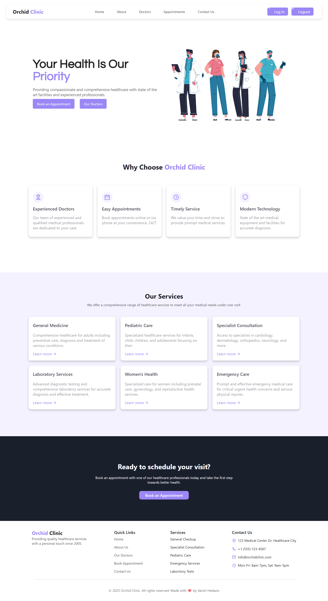
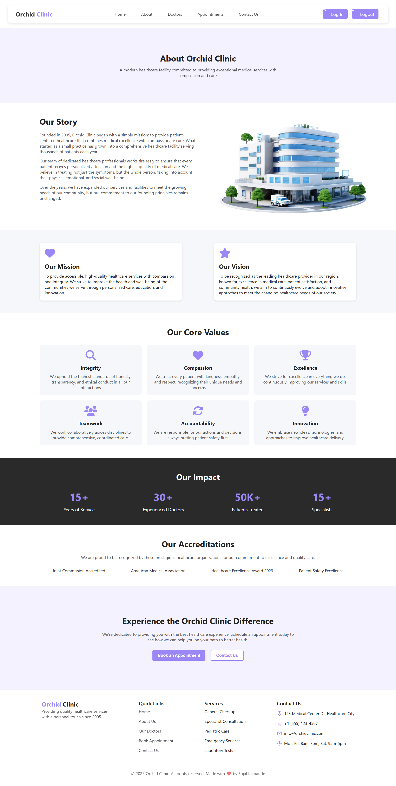
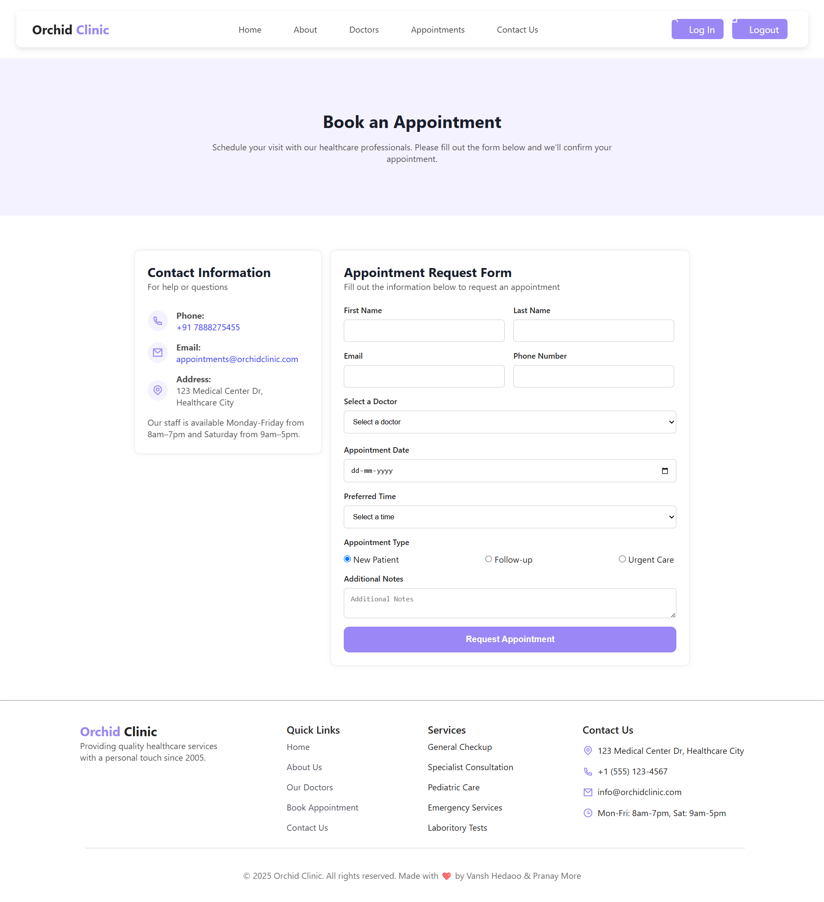
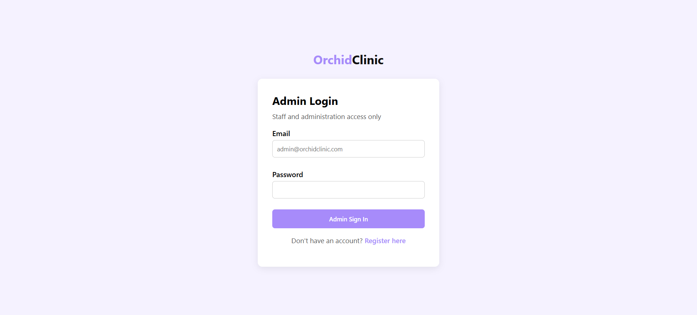
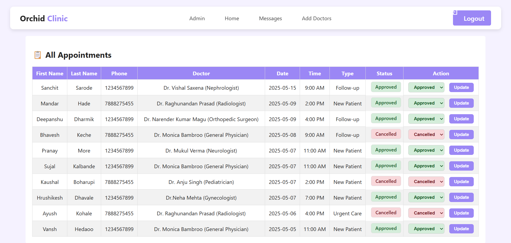
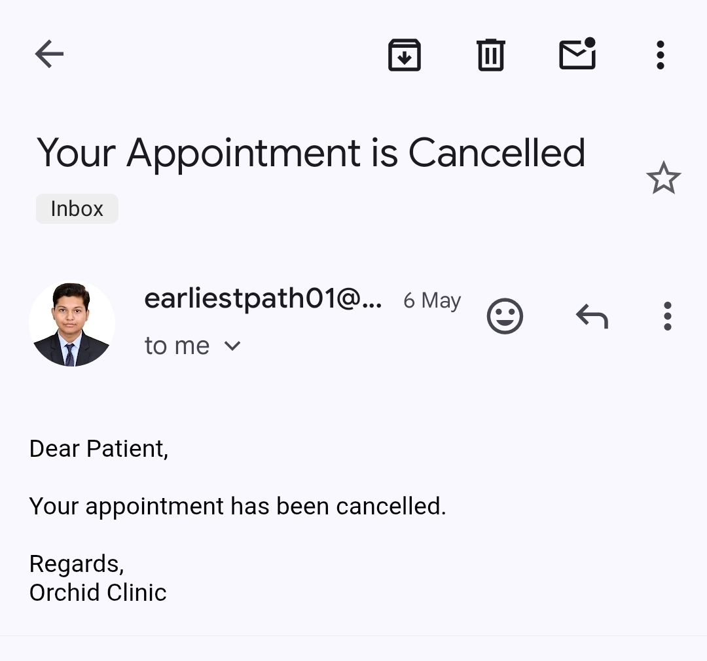
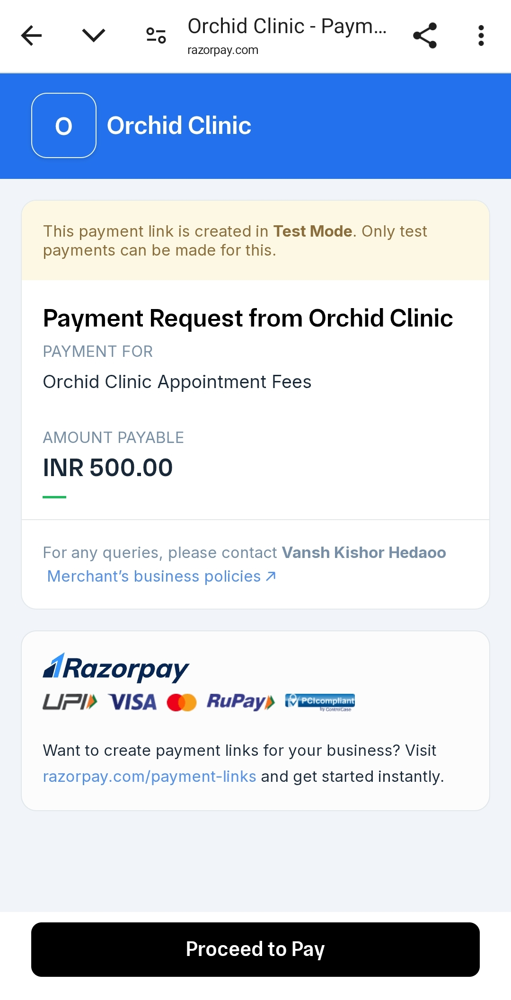

# 🏥 Hospital Management System (HMS)

A web-based Hospital Management System built using **Python (Flask)**, **SQLite**, and **Razorpay API** to digitize and streamline hospital operations like appointment booking, doctor management, and automated communication.

🔗 **Live Demo**: [Orchid Clinic](https://orchid-clinic.onrender.com)

---

## 📌 Features

- 🌐 Responsive web UI with HTML, CSS, Tailwind, and JavaScript
- 👨‍⚕️ Doctor profile viewing for patients
- 🗓️ Patient appointment booking system
- 🔐 Secure login and role-based access (Patient/Admin)
- 🧑‍💼 Admin dashboard to manage doctors, appointments, messages
- 📧 Email notifications (Appointment approved/cancelled)
- 💳 Razorpay payment integration for online fee payment

---

## 🎯 Aim

To design and develop a user-friendly hospital management system that improves communication and efficiency in hospital operations.

---

## 🎯 Objectives

1. Provide an online platform for patients to book appointments and access hospital info.
2. Enable admins to manage doctors, appointments, and contact messages securely.
3. Implement secure, role-based login for both patients and admins.

---

## 🧰 Tools & Technologies Used

### Front-End:
- HTML5 – Page structure
- CSS3 – Styling
- Tailwind CSS – Responsive UI
- JavaScript – Client-side interactivity
- Jinja2 – Templating engine

### Back-End:
- Python (Flask) – Web framework
- SQLite – Lightweight, file-based database
- Razorpay API – Payment link integration

### Other Tools:
- Render – Deployment platform
- Git & GitHub – Version control and collaboration
- Gmail SMTP – Automated email delivery
- VS Code – Code editor

---

## 📐 System Design Overview

### 👥 User Roles:
- **Patient:** Can register, log in, view doctors, and book appointments.
- **Admin:** Can log in securely to manage doctor info, appointments, contact messages, and send status updates.

### 🖥️ Pages:
- **Home:** Overview and navigation
- **About Us:** Hospital background and mission
- **Doctors:** Doctor profiles and specializations
- **Appointments:** Booking form for patients
- **Contact Us:** Feedback/contact form
- **Admin Dashboard:** Manage bookings and messages

---

## 🔁 Functional Workflow

1. Patients register/login and request an appointment.
2. Admin reviews the request and approves or cancels it.
3. Upon approval, the system sends a Razorpay payment link via email.
4. Once payment is completed, the appointment is confirmed and updated in the system.
5. Admin can track all interactions from a single dashboard.

---

## 📧 Email Notification System

- ✔️ **Appointment Approved**: Sends confirmation email with Razorpay payment link.
- ❌ **Appointment Cancelled**: Sends cancellation notification.
- 💰 **Payment Confirmation**: Marks appointment as "Paid" after successful transaction.

---

## 💡 Future Enhancements

- 📄 Digital prescriptions
- 🔔 Real-time push notifications
- 📱 Mobile app integration

---

## ✅ Result

The system provides a streamlined interface for hospital staff to manage appointments and patient queries efficiently, while patients experience a faster, digital-first healthcare booking process.

---

## 🏁 Deployment

This project is deployed using **Render** with support for Flask, SQLite, email services, and payment integration.

🔗 **Deployed Link**: [Orchid Clinic](https://orchid-clinic.onrender.com)

---

## 📸 Snapshots 

### 🏠 Homepage

*Figure 1: Homepage with navigation to About, Doctors, and Appointments*

### 📄 About Us Page

*Figure 2: About Us page showing hospital mission, values, and achievements.*

---

### 👨‍⚕️ Doctor Details Page

*Figure 3: List of doctors with their specialization, qualifications, and experience.*

---

### 📅 Appointment Booking Form

*Figure 4: Patient appointment form to select doctor, date, and time.*

---

### 🔐 Admin Login Page

*Figure 5: Secure login page for hospital administrators.*

---

### 📊 Admin Dashboard

*Figure 6: Admin panel to manage appointments, messages, and status updates.*

---

### 📧 Email Notifications

*Figure 7: Email sent to patient after appointment approval with Razorpay link.*

*Figure 8: Email sent to patient notifying them of appointment cancellation.*

---

### 💳 Razorpay Payment Window

*Figure 9: Razorpay window showing fee details and secure payment interface.*

---

